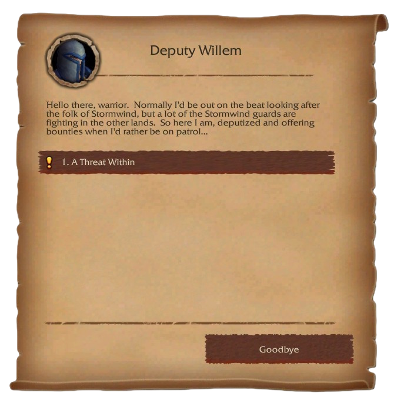
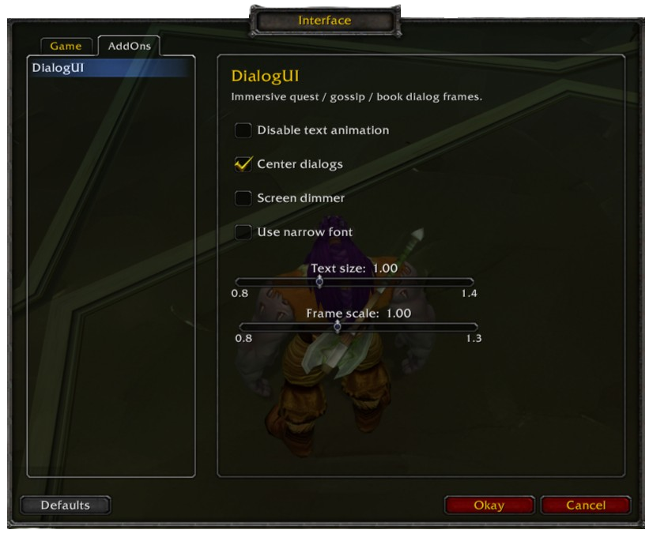

# DialogUI (WotLK 3.3.5a)

Immersive quest / gossip / book dialog frames for WoW 3.3.5a. Replaces the
default Blizzard frames with parchment-styled panels.

Fork of [Bset's WotLK port](https://github.com/ghbset/DialogUI-WotLK).

## Differences from the original port

**Added / Fixed**
- Focus mode split into two independent options: center dialogs and screen dimmer
- Long NPC names now truncated with "..." instead of disappearing behind the portrait
- Button text now renders correctly in WotLK 3.3.5a
- Centralized color palette in one place

**Removed**
- Dark mode — light parchment only
- Auto-advance — all NPC interactions are manual
- Right-side frame anchor — always docks left
- Key icon textures and key badge labels — buttons show clean text only
- `/dui` slash command alias

## Screenshots

| | |
|:---:|:---:|
|  |  |

## Credits

- Original: [Sxus](https://github.com/Jslquintero/DialogUI)
- WotLK port: [Bset](https://github.com/ghbset/DialogUI-WotLK)
- Inspiration: [DialogueUI](https://www.curseforge.com/wow/addons/dialogueui)
